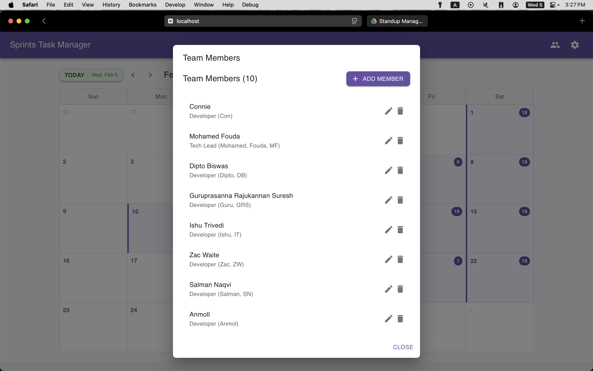

# Sprints Task Manager - User Guide

The Sprints Task Manager is a collaborative task management tool designed to help teams track and manage their daily tasks and sprints effectively.

## Calendar View

The Calendar View provides a monthly overview of your team's schedule:
- Navigate between months using the arrow buttons
- The current day is highlighted in green
- Days with tasks are marked with purple indicators
- Click on any day to view or manage tasks for that specific date

## Team Members Management

The Team Members panel allows you to:
- View all team members and their roles
- Add new team members using the "ADD MEMBER" button
- Edit member information using the pencil icon
- Remove members using the trash icon
- Each member has their role and abbreviation displayed below their name

## Report Generation

Generate custom reports for your team:
1. Select team members from the dropdown (or choose "All Team Members")
2. Set the start date for your report period
3. Set the end date for your report period
4. Click "GENERATE REPORT" to create the report
5. Use "CLOSE" to exit the report generation window

## Daily Task View

The Daily Task View shows:
- Tasks organized by team member
- Each member has their own card showing assigned tasks
- "No tasks assigned" is displayed when a member has no tasks for the day
- Use "ADD TASK" to create new tasks
- "PARSE TEXT" feature available for bulk task creation

## Task Management

Managing individual tasks:
- Each task displays a title and description
- Tasks show their current status (e.g., "todo")
- Edit tasks using the pencil icon
- Delete tasks using the trash icon
- Tasks are color-coded for better visibility
- Multiple tasks can be assigned to a single team member

## Tips for Best Use

1. **Regular Updates**: Update task statuses daily to maintain accurate tracking
2. **Team Communication**: Use the calendar view for planning team meetings and deadlines
3. **Report Generation**: Generate reports regularly to track team progress
4. **Task Organization**: Keep tasks specific and well-described for better team coordination
5. **Member Management**: Keep team member information up to date
